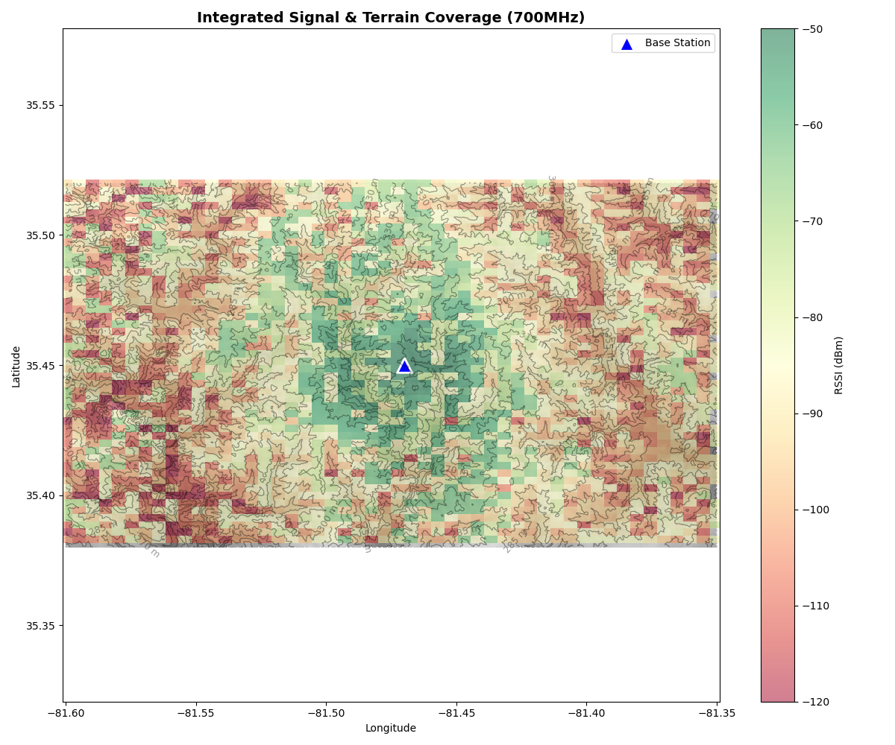

# ITM Signal Estimation

This repository encapsulates the Longley-Rice (ITM) model terrain and signal estimation workflow. It automates the following tasks with a given target area latitude and longitude:
1. **DEM Downloading**
2. **Grid-based / H3 based Path Loss Generation**
3. **GIS Overlay Mapping**

## Setup Instructions

This project relies on strict system-level geospatial C++ dependencies. **Do not use `pip install` directly for the data science packages**. Please use Anaconda/Miniconda to guarantee OS compatibility across Mac and Windows.

### 1. **Clone the repository and its submodule:**
   ```bash
   git clone https://github.com/MHcChiang/itm4truck.git
   cd itm4truck
   ```

### 2. Install `itmlogic`
We use [itmlogic](https://github.com/edwardoughton/itmlogic) to compute Longley-Rice (ITM) path loss. Clone and install from source:

```bash
git clone https://github.com/edwardoughton/itmlogic.git
```

### 3. Create Python Environment with Conda

```bash
conda env create -f environment-itm.yml
```

### 4. Install H3
Follow the instruction on [H3](https://h3geo.org/docs/installation)

## Usage

Run `main.py` to compute the estimated RSSI for the test region using a standard square grid:
```bash
python main.py
```

To run the estimation using an H3 hexagonal grid instead, use the `--h3` flag:
```bash
python main.py --h3
```

The result should be like:




